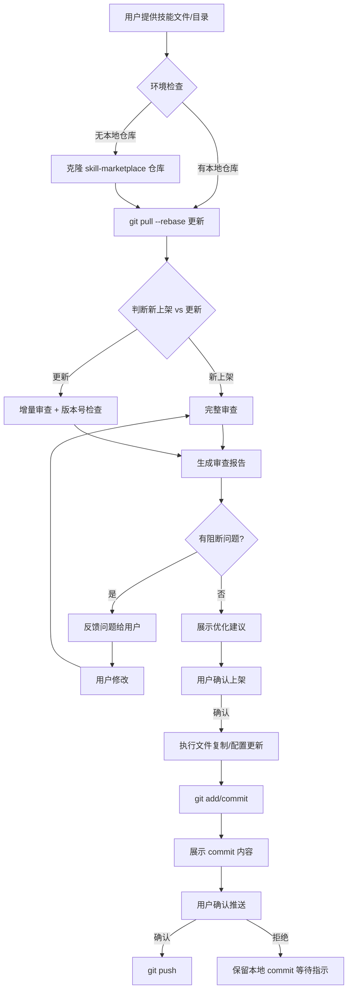

## 产品概述

创建一个名为 `skill-marketplace-manager` 的综合技能，用于自动化管理 CodeBuddy 官方技能市场（skill-marketplace）的技能审查与上架/更新全流程。该技能将成为技能市场管理员的核心工具，任何人在任何环境下都可以使用。

## 核心功能

### 1. 环境自适应

- 自动检测当前是否有已克隆的 skill-marketplace 本地仓库
- 若无本地仓库，自动从远程 `https://cnb.woa.com/genie/skill-marketplace` 克隆
- 首次使用时询问用户 git 令牌（用于推送），记录到配置文件 `~/.skill-marketplace-manager/config.json`
- 令牌过期时引导用户更新
- 每次操作前自动 `git pull --rebase` 确保本地最新

### 2. 智能判断（新上架 vs 更新）

- 给定开发者提交的文件/文件夹后，自动读取其 SKILL.md 的 `name` 字段
- 对比仓库中 `skills/` 目录和 `marketplace.json` 已有条目
- 自动判断是"新上架"还是"更新已有技能"，并告知用户

### 3. 技能审查（Review）

严格按标准逐项检查，并区分"阻断问题"（必须修复）和"优化建议"（可选优化）：

**阻断问题检查项：**

- SKILL.md 是否存在、frontmatter 是否有效
- 目录名是否为 kebab-case
- 必需字段（description / description_zh / description_en）是否存在
- 字段顺序是否正确（name - description - description_zh - description_en - 其他）
- description_zh 长度（25-35 中文字符）、description_en 长度（60-80 英文字符）
- version 格式是否为语义版本（不带 v 前缀）
- 字段值引号使用是否一致、无多余引号
- 图标文件名是否匹配 source 字段（{source}.svg 或 {source}.png）
- 不应入库的文件检查（README.md、CODEBUDDY.md 等）

**优化建议检查项：**

- description 是否包含足够的触发场景和关键词
- description_zh 是否过短（虽合规但信息量不足）
- 是否缺少 allowed-tools 声明
- SKILL.md 内容质量（有无快速开始示例、清晰的标题结构、故障排除等）
- 是否缺少 homepage、version 等可选但推荐字段
- references/ 和 scripts/ 目录组织是否合理

### 4. 上架/更新执行（Publish）

- 将通过审查的文件复制到仓库对应目录（排除不应入库的文件）
- 图标重命名并放入 `icons/` 目录
- 新增或更新 `marketplace.json` 条目（按字母顺序插入、字段顺序正确）
- 验证 JSON 有效性
- 生成变更摘要，展示给用户确认
- 用户明确确认后才执行 `git add` / `git commit` / `git push`
- 用户不确认则暂停，等待进一步指示

### 5. 交互式修复循环

- 审查发现问题后，生成结构化的审查报告
- 用户可提出修改意见或直接修改源文件
- 重新审查直至无阻断问题
- 全程保持与用户的交互，不自主执行最终提交

## 技术栈

- 纯 Markdown Skill（SKILL.md + references/），不依赖外部脚本
- 工具链：Read, Write, Edit, Bash, Glob, Grep（CodeBuddy 内置工具）
- Git CLI 操作（clone, pull, add, commit, push）
- JSON 校验使用 Node.js 内联脚本或 `jq`

## 实现方案

该技能采用 **纯指令型 Skill** 设计（无 Python/JS 脚本依赖），完全通过 SKILL.md 中的详细指令引导 AI Agent 执行审查和上架操作。这样做的优势：

1. **零依赖**：不需要安装 Python/Node.js 环境
2. **跨平台**：Windows/macOS/Linux 通用
3. **易维护**：修改审查标准只需更新 Markdown 文件
4. **可扩展**：新增检查项只需在 references/review-standards.md 中补充

### 关键技术决策

1. **不使用 Python 脚本做自动化检查**：虽然 quick_validate.py 是先例，但该脚本只检查基础字段，且需要 PyYAML 依赖。我们的审查需求远超其范围（字段长度、引号格式、marketplace.json 一致性等），由 AI Agent 直接读取文件并按标准逐项检查更灵活高效。

2. **配置文件使用 JSON 格式**：存储在 `~/.skill-marketplace-manager/config.json`，包含仓库路径和 git 令牌，用 Bash 的 `cat`/`echo` 操作即可读写，无额外依赖。

3. **子技能通过 references 实现**：审查标准（review-standards.md）和上架流程（publish-workflow.md）作为参考文档，主 SKILL.md 按条件分发到对应流程，实现"子技能"效果。

## 实现注意事项

- **Git 令牌安全**：配置文件权限应设置为 600（仅用户可读写），令牌不得出现在 git 提交内容中
- **并发安全**：每次操作前先 `git pull --rebase`，push 失败后自动 rebase 重试
- **图标处理**：icons/ 目录在 .gitignore 中未列出（实际会被跟踪），需正确处理
- **marketplace.json 编辑**：必须确保编辑后 JSON 有效，使用 Node.js JSON.parse 或 jq 验证
- **向后兼容**：部分已有条目有 examples_zh/examples_en/version 额外字段，新增条目也应支持这些可选字段

## 架构设计



## 目录结构

```
skills/skill-marketplace-manager/
├── SKILL.md                           # [NEW] 主技能文件（综合调度入口，约 350 行）
│                                      #   - 环境自适应（仓库检测/克隆/令牌管理）
│                                      #   - 智能判断新上架 vs 更新
│                                      #   - 调度审查和上架两大子流程
│                                      #   - 交互式修复循环和用户确认机制
│                                      #   - frontmatter: name, description, description_zh,
│                                      #     description_en, version, allowed-tools
│
└── references/
    ├── review-standards.md            # [NEW] 审查标准详细参考（约 300 行）
    │                                  #   - 阻断问题检查清单（20+ 项）
    │                                  #   - 优化建议检查清单（10+ 项）
    │                                  #   - 每项含：检查方法、判定标准、修复建议
    │                                  #   - 从实际审查经验提炼的常见问题模式
    │                                  #   - 审查报告输出模板
    │
    └── publish-workflow.md            # [NEW] 上架/更新工作流参考（约 200 行）
                                       #   - 新上架完整步骤（文件复制/图标/marketplace.json）
                                       #   - 更新已有技能步骤（版本号递增/差异对比）
                                       #   - marketplace.json 编辑规范（字段顺序/插入位置）
                                       #   - Git 操作流程（add/commit/push + 冲突处理）
                                       #   - 配置文件管理规范

.codebuddy-skill/marketplace.json      # [MODIFY] 新增 skill-marketplace-manager 条目
                                       #   - 插入位置：skill-creator 与 skill-scanner 之间
                                       #   - 包含 name/description/description_zh/description_en/source
                                       #   - 包含 examples_zh/examples_en
```

## Agent Extensions

### SubAgent

- **code-explorer**
- 用途：在创建 review-standards.md 时，需要扫描仓库中多个现有技能的 SKILL.md 和 marketplace.json 条目，提取实际的字段模式、常见问题模式和最佳实践，确保审查标准基于真实数据
- 预期结果：获取充分的现有技能样本数据，使审查标准精准且实用

### Skill

- **skill-creator**
- 用途：参考 skill-creator 的最佳实践来构建本技能的 SKILL.md 结构，确保遵循 Progressive Disclosure 原则和 Concise is Key 原则
- 预期结果：产出的 SKILL.md 符合技能开发标准，结构精简高效