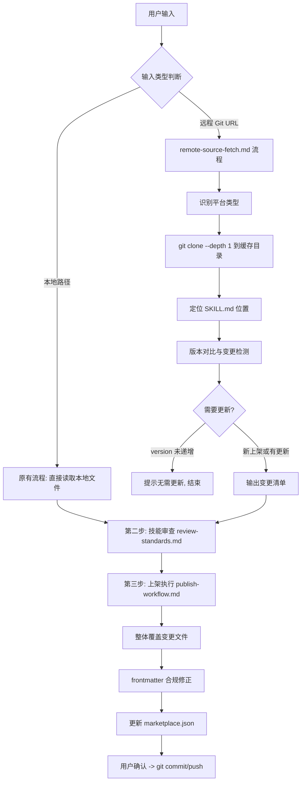

## 用户需求

优化 `skill-marketplace-manager` 技能（当前 v1.1.0），新增"远程 Git 仓库自动获取与对比"能力，使上架/更新流程从"用户手动提供本地文件"升级为"用户提供源 Git 仓库地址，自动拉取、对比、审查、上架"的全自动化流程。

## 产品概述

基于实际操作 AndonQ skill 更新时遇到的痛点（手动 API 逐文件获取、手动 blob hash 对比、大段文件替换卡住等），为 skill-marketplace-manager 新增远程仓库源接入层，实现一条命令式的技能上架/更新体验。

## 核心功能

1. **远程 Git 仓库接入**：用户提供源仓库 URL（支持工蜂 git.woa.com、GitHub、CNB 等）+ 可选的分支名和 skill 子目录路径，自动识别平台类型并通过对应 API 获取文件树和文件内容，缓存到本地临时目录

2. **版本对比与变更检测**：自动解析远程 SKILL.md 的 version 字段，与 skill-marketplace 中已有版本对比（version 高于本地则需更新、不存在则为新上架、version 不高于本地则提示无需更新）；逐文件 hash 对比输出新增/修改/删除/未变文件清单

3. **整体覆盖+局部修正策略**：对有变更的文件采用"远程版本整体覆盖，再做 frontmatter 合规修正"的策略（而非逐行替换），避免大文件编辑卡住

4. **架构解耦**：新增独立的 `references/remote-source-fetch.md` 参考文档承载远程获取逻辑，避免主 SKILL.md 过度臃肿；同步更新 publish-workflow.md 的覆盖更新策略

5. **边界场景处理**：远程 skill 目录结构不统一时支持用户指定或自动检测 SKILL.md 位置；处理认证失败、分支指定、大文件 base64 解码、文件编码差异（BOM/CRLF）、远程文件删除同步提示、version 缺失时的推断等

## 技术栈

- 纯 Markdown Skill（SKILL.md + references/），无外部脚本依赖
- 工具链：Read, Write, Edit, MultiEdit, Bash, Glob, Grep（CodeBuddy 内置）
- Git CLI + curl（用于远程 API 调用）
- 平台 API：工蜂 GitLab REST API v3、GitHub REST API v3、CNB GitLab API

## 实现方案

### 核心策略：新增远程源获取层 + 复用已有审查上架流程

在现有三步流程（环境准备 -> 接收审查 -> 上架执行）的基础上，在"第一步"之前插入"第 0.5 步：远程源获取"，将远程仓库的文件拉取到本地临时目录后，后续流程无缝复用现有逻辑。

### 关键技术决策

1. **使用 `git clone --depth 1 --branch <branch>` 而非逐文件 API 获取**

AndonQ 更新时使用工蜂 GitLab API 逐文件 base64 获取效率极低。改用 shallow clone 一次性获取整个仓库（或指定分支），效率高、实现简单、不依赖特定平台 API 格式。

- 优势：跨平台通用（工蜂/GitHub/CNB 都支持 git clone）、无需处理 base64 编码、无需逐文件 API 调用
- 劣势：会下载整个仓库（但 `--depth 1` 只取最新一层提交，体积很小）
- 回退方案：如果 git clone 失败（如私有仓库无 git 访问权限），再降级到 API 逐文件获取

2. **临时目录策略**

clone 到 `~/.skill-marketplace-manager/cache/<repo-name>-<branch>/`，每次操作前清理旧缓存。不使用系统临时目录（避免清理不可控）。

3. **版本对比使用语义版本比较而非字符串比较**

解析 `MAJOR.MINOR.PATCH` 三段数字做数值比较，避免 `1.9.0 > 1.10.0` 的字符串比较错误。

4. **文件差异检测使用 git hash-object**

对远程文件和本地 skill-marketplace 中的对应文件分别计算 git blob hash，快速判断是否有变更，避免逐字节比对大文件。

5. **整体覆盖+局部修正策略**（从 AndonQ 经验总结）

有变更的文件：远程版本整体覆盖 -> 仅修正 frontmatter 不合规处（name 大小写、字段顺序）。这比逐段 replace 高效得多且不会卡住。

### 架构解耦设计

当前文件总量已较大（SKILL.md 313行 + review-standards.md 413行 + publish-workflow.md 315行 = 1041行），新增远程获取逻辑不宜全部塞入 SKILL.md。采用新增独立 reference 文件的方式：



## 实现注意事项

1. **git clone 认证处理（含令牌遗忘/过期的完整处理链）**：

采用**渐进式认证策略**，按以下优先级逐级尝试，每一级失败后自动升级到下一级：

```
第1级：无认证 clone（公共仓库直接成功）
↓ 失败（fatal: Authentication failed / 401 / 403）
第2级：检查 config.json 中已存储的令牌，用令牌重试 clone
↓ 失败（令牌过期或无效）
第3级：主动提示用户提供/更新令牌，用新令牌重试 clone
↓ 用户无法提供令牌
第4级：降级到平台 API 逐文件获取（某些平台支持无认证 API 读取公共仓库）
↓ 仍然失败
终止：明确告知用户无法访问该仓库，给出排查建议
```

**具体场景处理**：

| 场景 | 表现 | 处理方式 |
| --- | --- | --- |
| 公共仓库 | clone 直接成功 | 无需令牌，正常继续 |
| 私有仓库 + 用户未提供令牌 | clone 返回 401/403 | 提示"该仓库需要访问令牌"，引导用户获取令牌（给出对应平台的令牌获取页面链接） |
| 私有仓库 + config.json 有令牌但已过期 | clone 返回 401/403 | 提示"已存储的令牌已过期"，引导用户更新令牌，更新 config.json |
| 私有仓库 + 用户提供了新令牌 | 用新令牌重试 clone | 成功则存入 config.json 供后续使用；失败则提示令牌可能权限不足 |
| 仓库地址错误 | clone 返回 404 / repository not found | 提示"仓库地址不存在或无权限"，请用户确认 URL 正确性 |
| 网络问题 | clone 超时或连接拒绝 | 提示网络问题，建议检查网络连接和代理设置 |


**令牌获取引导模板**（按平台）：

- 工蜂(git.woa.com)：引导到 `https://git.woa.com/profile/personal_access_tokens`，需要 `read_repository` 权限
- GitHub：引导到 `https://github.com/settings/tokens`，需要 `repo` 权限
- CNB(cnb.woa.com)：引导到对应的访问令牌设置页

**令牌存储**：成功的令牌按 host 维度存入 config.json（支持同时存储多个平台的令牌），格式扩展为：

```
{
"repo_path": "...",
"git_tokens": {
"git.woa.com": { "username": "xxx", "token": "xxx", "updated": "..." },
"github.com": { "username": "xxx", "token": "xxx", "updated": "..." }
}
}
```

2. **skill 子目录自动检测**：clone 后在仓库中搜索 `SKILL.md` 文件。如果只找到一个则自动选中；如果找到多个则列出让用户选择；如果用户已指定 skill 路径则直接使用。

3. **文件编码统一**：覆盖前统一将 LF/CRLF 标准化为目标仓库的换行风格（skill-marketplace 使用 LF），避免出现 git diff 中的无意义换行差异。

4. **缓存清理**：每次远程获取前先清理同名缓存目录，避免旧数据残留。操作完成后可选清理（提示用户）。

5. **向后兼容**：保持原有"本地路径输入"方式完全不变，远程 URL 输入是纯增量能力。

## 目录结构

```
C:\Users\v_xinocwang\.codebuddy\skills\skill-marketplace-manager\
├── SKILL.md                              # [MODIFY] 主技能文件：version 升至 2.0.0，重构第一步为"技能源获取"，新增远程 URL 输入分支，增加入口判断逻辑（本地路径 vs 远程 URL），新增版本对比与变更检测结果展示格式，更新流程图。在第三步中增加"整体覆盖+局部修正"策略引用。核心原则中新增"远程源优先"原则。
│
└── references/
    ├── remote-source-fetch.md            # [NEW] 远程源获取参考文档（约 250 行），包含：
    │                                     #   - 远程 URL 解析规则（工蜂/GitHub/CNB/通用 Git）
    │                                     #   - git clone --depth 1 获取策略（含认证处理、分支指定）
    │                                     #   - API 降级获取策略（clone 失败时的回退方案）
    │                                     #   - SKILL.md 自动定位逻辑（单文件/多文件/用户指定）
    │                                     #   - 版本对比算法（语义版本解析与比较）
    │                                     #   - 文件差异检测（git hash-object 对比，输出变更清单）
    │                                     #   - 临时缓存目录管理（创建/清理/路径规范）
    │                                     #   - 边界场景处理（认证失败、分支不存在、大文件、编码差异、远程文件删除检测）
    │
    ├── review-standards.md               # [MODIFY] 审查标准：新增 B17 远程源与本地一致性检查项（确认远程获取的文件完整性），微调部分检查项的说明以适配远程源场景
    │
    └── publish-workflow.md               # [MODIFY] 上架工作流：步骤3"覆盖更新"重写为"整体覆盖+局部修正"策略（远程文件整体覆盖 -> frontmatter 合规修正），新增变更文件选择性更新逻辑（只处理有变更的文件），新增远程文件删除同步提示
```

## 关键代码结构

以下为 `remote-source-fetch.md` 中需要定义的核心流程接口（伪代码形式描述输入输出）：

```
# 远程源获取流程的输入参数
RemoteSourceInput:
  repo_url: string       # 必填，源仓库地址（HTTPS 格式）
  branch: string         # 可选，分支名，默认 main/master
  skill_path: string     # 可选，skill 在仓库中的子目录路径
  auth_token: string     # 可选，访问令牌（私有仓库需要）

# 远程源获取流程的输出
RemoteSourceOutput:
  local_cache_path: string        # 缓存到本地的路径
  skill_name: string              # 解析出的技能名
  remote_version: string          # 远程版本号
  local_version: string | null    # skill-marketplace 中的当前版本（新上架为 null）
  operation_type: "new" | "update" | "skip"  # 操作类型
  changed_files: list             # 变更文件清单 [{path, status: added|modified|deleted|unchanged}]
```

## Agent Extensions

### Skill

- **skill-marketplace-manager**
- 用途：作为本次修改的直接目标，需要完整理解其当前 v1.1.0 的实现（SKILL.md + 2 个 references）以精确更新
- 预期成果：技能从 v1.1.0 升级到 v2.0.0，新增远程 Git 仓库自动获取与版本对比能力

### SubAgent

- **code-explorer**
- 用途：在创建 remote-source-fetch.md 时，需要扫描 skill-sources.md 了解各 skill 的远程仓库地址模式，以及扫描现有 skill 目录结构了解不同来源 skill 的文件组织差异
- 预期成果：获取足够的仓库 URL 模式和文件结构样本，使远程获取逻辑覆盖主要场景